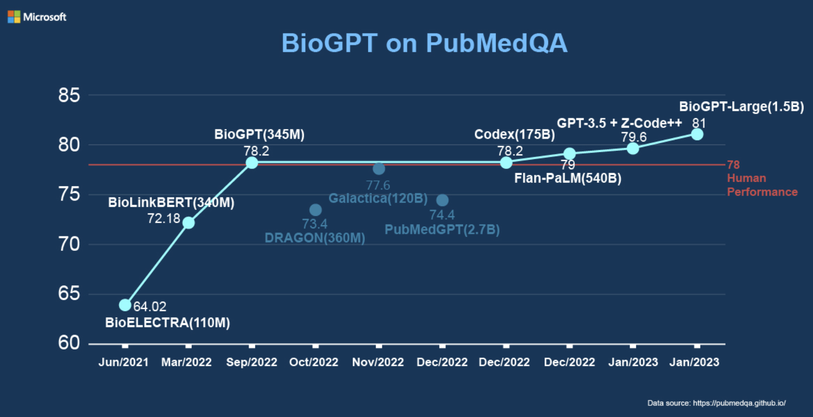

# 🧬 Biomedical Literature Helper with BioGPT 🧬

Welcome to the **Biomedical Literature Helper with BioGPT**! This Streamlit application leverages the power of the BioGPT language model to assist researchers, clinicians, and enthusiasts in generating and mining biomedical texts efficiently. Whether you're drafting research papers, summarizing complex biomedical information, or exploring new hypotheses, this tool is here to streamline your workflow.

 <!-- Replace with an actual image URL if available -->

## 🌟 Features

- **Advanced Text Generation:** Utilize BioGPT to generate coherent and contextually relevant biomedical text based on your input prompts.
- **Multiple Model Options:** Choose from various pre-trained BioGPT models to suit your specific needs.
- **Customizable Output:** Adjust parameters like minimum and maximum sequence lengths, and the number of generated sequences.
- **User-Friendly Interface:** Intuitive layout with real-time feedback and interactive elements.
- **Example Prompts:** Explore pre-defined examples to understand the capabilities of BioGPT.

## 📦 Installation

Follow these steps to set up the application on your local machine:

### 1. Clone the Repository

```bash
git clone https://github.com/alphatechlogics/BiomedicalLiteratureHelperWithBioGPT.git
cd biogpt-biomedical-helper
```

### 2. Create a Virtual Environment

It's recommended to use a virtual environment to manage dependencies.

```bash
# Using virtualenv

python3 -m venv env
source env/bin/activate # On Windows: env\Scripts\activate

# Or using Conda

conda create -n biogpt-env python=3.10
conda activate biogpt-env
```

### 3. Install Dependencies

Ensure you have `pip` updated, then install the required packages:

```bash
pip install --upgrade pip
pip install -r requirements.txt
```

### 4. Download BioGPT Models

The application uses pre-trained BioGPT models from Hugging Face. Ensure you have sufficient disk space and a stable internet connection to download these models.

### 5. Run the Application

Launch the Streamlit app with the following command:

```bash
streamlit run app.py
```

The app should automatically open in your default web browser. If not, navigate to `http://localhost:8501` in your browser.

## 🚀 Usage

### 📝 Generating Biomedical Text

1. **Select a Pre-trained Model:**

   - Choose from available BioGPT models such as:
     - `microsoft/biogpt`
     - `microsoft/BioGPT-Large`
     - `microsoft/BioGPT-Large-PubMedQA`

2. **Configure Model Parameters:**

- **Minimum Output Length**: Set the minimum number of tokens for the generated text.
- **Maximum Output Length**: Define the maximum number of tokens for the output.
- **Number of Sequences**: Specify how many different text sequences you want BioGPT to generate.

3. **Input Text:**

- Enter the prompt or initial text for which you want BioGPT to generate content. For example:

```bash
Diabetes is
```

4. **Generate Text:**

- Click on the **Generate Tex**t button. The app will process your input and display the generated biomedical text(s) along with the time taken for generation.

5. **Reset Inputs:**

- Use the **Reset** button to clear your inputs and start a new generation session.

### 📚 Exploring Examples

- Scroll down to the Examples section to view pre-defined prompts and their generated outputs. This can help you understand how to craft effective prompts for your needs.

## 🛠️ Dependencies

The application relies on the following key packages:

- Streamlit: For building the interactive web interface.
- Transformers: To access and utilize the BioGPT models.
- Torch: Backend for model computations.
- Sacremoses: Required by BioGptTokenizer for text processing.
- Pandas: For handling data structures and displaying examples.
  Ensure all dependencies are installed as per the Installation section.

## 🧩 File Structure

- `app.py`: Main Streamlit application script.
- `utils.py`: Contains utility functions and predefined variables like available models and examples.
- `requirements.txt`: Lists all Python dependencies (ensure this file is present).
- `README.md`: Project documentation (this file).
